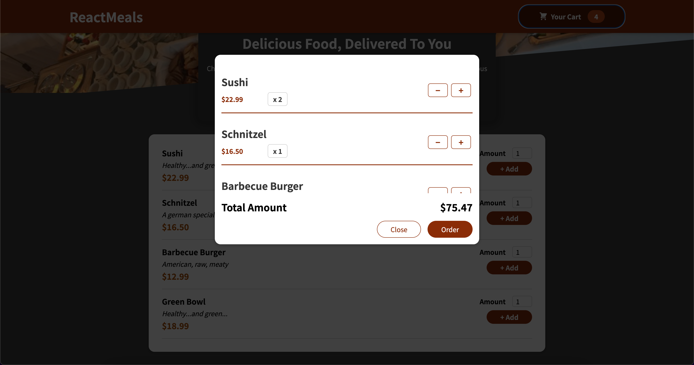

# Food Ordering App

Welcome to the Food ordering App. In this web app, you will be able to select items to order.

- You can select items to add to your cart.
- Also, you can see the selected items inside the cart and add or reduce the quantity.
- Finally, you can submit your order.

### 🖥️ Desktop version

#### This is the home page, where you can see and interact with the available foods to order

#### This is the cart page, where you can see items added to cart and add or remove items quantity inside the cart

####  Finally, this interface where to added information for ordering the foods

### 📱 Mobile version

Here you can take a look at the different pages for the mobile version

#### Home Page

#### Missions Page

#### My Profile Page

## 🧩 Built With

- React.js
- React-router
- React Context API
  

## 📚 Getting Started

To get a local copy up and running, you can follow these simple example steps:

### Prerequisites

For this project, you don't need additional tools

<!-- For this project to run you will need the following tools:
- requisite -->

### Setup

Fork a copy to your repository

### Install

Clone the repository on your local environment and run `npm i` on your terminal

### Usage

To start the dev server, just run `npm start`.
You can work in your favorite Code Editor

## 💻📱 Live Preview

If you want to see a live demo of this project, [click here](https://food-order-app-9b2b3.firebaseapp.com/)

## Authors

👤 **Mihreteab Misganaw Aride**

- GitHub: [@Mre55](https://github.com/Mre55)
- Twitter: [@MreMisganaw](https://twitter.com/MreMisganaw)
- LinkedIn: [@Mihreteab-Aride](https://www.linkedin.com/in/mihreteabaride/)

## 🤝 Contributing

Contributions, issues, and feature requests are welcome!

Please feel free to check the [issues page](../../issues).

## 👏 Show your support

Give a ⭐️ if you like this project!

## 📝 License

Copyright (c) Mihreteab Misganaw
